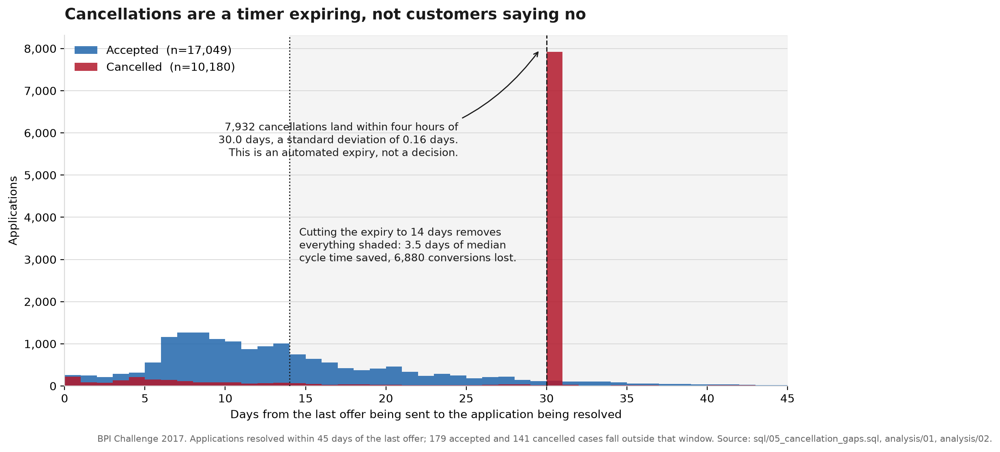

# Where a loan application stalls

Process mining on 31,509 consumer loan applications from a Dutch bank's event log: **where the three weeks actually go, and which single change would shorten them.**

---

## The three documents

| | |
|---|---|
| **[`BRIEF.md`](BRIEF.md)** | The engagement as scoped: the client's question, the four analytical questions it decomposes into, and what was deliberately left out. **Read this to see what was asked.** |
| **[`REPORT.md`](REPORT.md)** | The memo. Findings, recommendation, and the caveats that qualify them. **Read this for the answer.** |
| **[`DATA.md`](DATA.md)** | Provenance, every cleaning decision with its reasoning and the risk accepted, what the data can and cannot support, and the known data-quality issues. **Read this to judge whether to believe the numbers.** |

## The headline

**A median application takes 19 days and receives about 26 minutes of work.**

Of 690,035 application-days processed over 397 days, 565: **0.08%**, were spent handling applications. Nearly a third of the total is an automated 30-day timer running out on customers who never replied, and one day in seven is a step being done a second time.



7,932 cancellations land within four hours of 30.0 days after the last offer, a standard deviation of 0.16 days. That is not customers declining; it is a rule firing.

**The obvious fix loses.** Shortening the expiry to 14 days saves 3.5 days of median cycle time and destroys 39.9% of conversions, €139.1m of principal. Tested at five thresholds; it loses at every one. The recommendation is instead to act in the 26.8 days of silence that precede the timer, and to test it in a randomised trial rather than deploy it, because the observational relationship between chasing and acceptance is confounded.

## How it was built

Every analytical question is answered in **hand-written SQL** against a DuckDB database. Python does ingestion, orchestration and one figure: not analysis.

```
sql/            the model: events, offers, cases, durations, transitions
analysis/       one numbered file per question, plus 08 which regenerates every
                figure quoted in the memo and 09 which sizes the proposed trial
src/procmine/   ingestion and database helpers, importable and tested
tests/          run against a five-case fixture whose answers were computed on paper
figures/        the figure above, regenerated from the database
```

Two things are worth a look if you are assessing the engineering rather than the findings:

- **[`DATA.md`](DATA.md)**, every cleaning decision with its reasoning and the risk accepted, plus nine known data-quality issues. Including a daylight-saving bug that silently corrupted 11.3% of durations, found by a reconciliation assertion rather than by inspection, and the bad fix that assertion then caught.
- **`tests/test_model.py`**, the fixture's expected values were hand-computed *before* the SQL was written, so a test failing means the SQL is wrong rather than that it changed.

## Data

BPI Challenge 2017, published via 4TU.ResearchData. Source, licence, retrieval steps and the publisher's own documentation are recorded in [`DATA.md`](DATA.md). The raw log is not committed; `DATA.md` says how to fetch it.

## Running it

```bash
python -m venv .venv
source .venv/bin/activate
pip install -e ".[dev,ingest]"
pytest
```

Then fetch the log per [`DATA.md`](DATA.md) and build the store:

```bash
python -m procmine.load
python figures/make_figure.py
```

Any file in `analysis/` then runs against `data/processed/loans.duckdb`.
